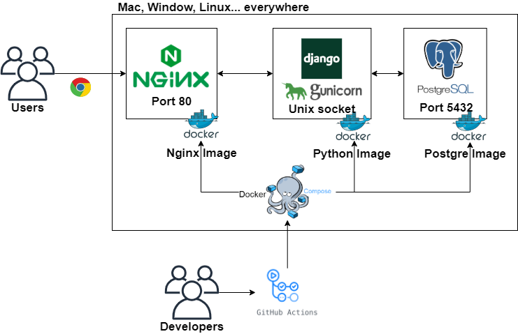

<h1 align="center">Welcome to Pybo 👋</h1>
<h3 align="center"><a href="./english.md">English</a></h3>

<br><br>

## ❓ What is Pybo?

[점프 투 장고](https://wikidocs.net/book/4223) 책을 공부하고 만든 장고 프로젝트를 컨테이너 환경에 구축합니다. Pybo는 책에 나오는 프로젝트 이름입니다. 이 장고 프로젝트를 업그레이드해서 실제로 책의 [저자](https://github.com/pahkey)가 [사이트](https://pybo.kr/pybo/question/list/qna/)를 운영하고 있습니다. 책의 단원별 소스 코드는 [여기](https://github.com/pahkey/djangobook)에 있습니다. 

<br>

## 📜 How to

[도커](https://docs.docker.com/get-started/)와 [도커컴포즈](https://docs.docker.com/compose/install/)를 설치해야 합니다. 

### 실행

```bash
$ docker-compose up -d
$ docker ps
```

ip주소 + 포트 80번으로 접속

### 정지 및 삭제

```bash
$ docker-compose stop
$ docker-compose down
```

### More..

```bash
# 관리자 계정 생성
$ docker exec -it django-pybo /bin/bash
$ python manage.py createsuperuser
...
$ exit
```

```bash
# 데이터베이스 삭제
$ docker-compose down
$ sudo find . -path "*/migrations/*.py" -not -name "__init__.py" -delete
$ sudo find . -path "*/migrations/*.pyc"  -delete
$ sudo rm -rf data/
$ docker-compose up -d
```

```bash
# 로그
$ cat logs/mysite.log
```

<br>

## 📌 Architecture



<br>

## 🚩 Features

* 회원 로그인 & 로그아웃
* 질문 및 답변 게시판
* 질문과 답변 각각에 대해 comment
* 좋아요 표시
* 게시글 검색 & 정렬
* 글 작성시에 마크다운 지원

<br>

## 📝 License

장고 프로젝트의 저작권은 책의 [저자](https://github.com/pahkey)에게 있습니다.<br>
Copyright © 2021 [IN HYO PARK](https://github.com/parkinhyo).<br/>
This project is [MIT](https://github.com/PARKINHYO/pybo-docker/blob/master/LICENSE) licensed.
***
_This README was generated with ❤️ by [readme-md-generator](https://github.com/kefranabg/readme-md-generator)_